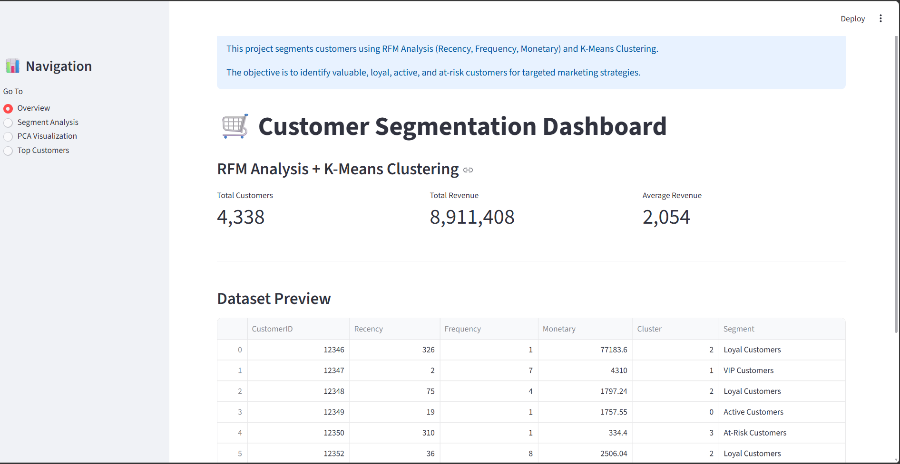
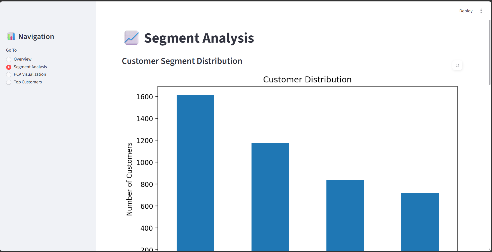
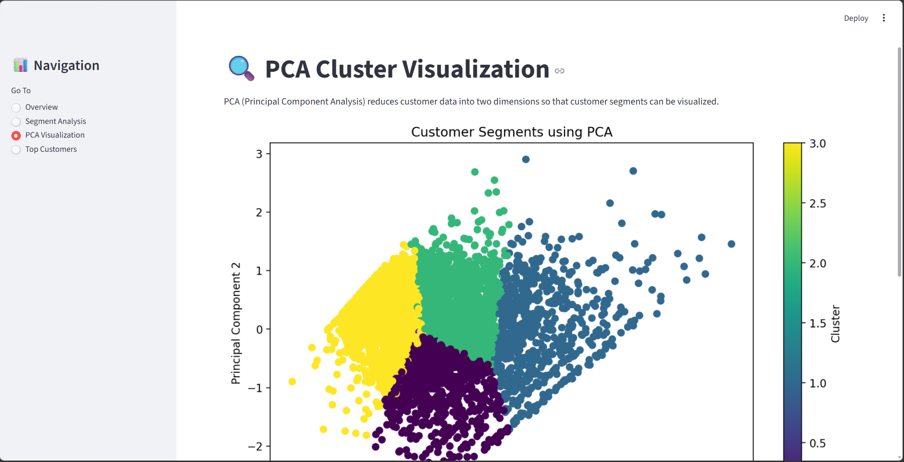
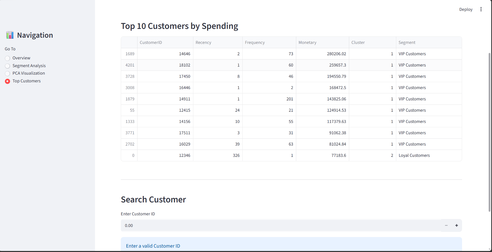

# Customer Segmentation using RFM Analysis and K-Means Clustering

## Project Overview

This project performs customer segmentation on an e-commerce dataset using RFM (Recency, Frequency, Monetary) Analysis and K-Means Clustering.

The objective is to identify different customer groups such as VIP Customers, Loyal Customers, Active Customers, and At-Risk Customers to support targeted marketing and customer retention strategies.

---

## Live Demo

🚀 Streamlit Dashboard: **[Click Here to Explore the Live Application](https://customersegmentation-jwthpwjxfyexn8mmuq5xfi.streamlit.app/)**

---

## Features

* Data Cleaning and Preprocessing
* Feature Engineering
* RFM Analysis
* Exploratory Data Analysis (EDA)
* Log Transformation and Scaling
* K-Means Clustering
* Silhouette Score Evaluation
* PCA Visualization
* Interactive Streamlit Dashboard

---

## Technologies Used

* Python
* Pandas
* NumPy
* Matplotlib
* Seaborn
* Scikit-Learn
* Streamlit

---

## Dataset

Online Retail Dataset containing customer transactions from a UK-based online retailer.

---

## Customer Segments Identified

### VIP Customers

* High frequency purchases
* High monetary value
* Recently active

### Loyal Customers

* Regular purchases
* Consistent spending behavior

### Active Customers

* Recently active
* Potential future loyal customers

### At-Risk Customers

* Low activity
* Require retention campaigns

---

## Project Workflow

1. Data Cleaning
2. Feature Engineering
3. RFM Analysis
4. Exploratory Data Analysis
5. Log Transformation
6. Standard Scaling
7. K-Means Clustering
8. Silhouette Score Evaluation
9. PCA Visualization
10. Streamlit Dashboard Development

---

## Dashboard Screenshots

## Dashboard Screenshots

### Overview Dashboard

Displays key business metrics including:
- Total Customers
- Total Revenue
- Average Revenue
- Dataset Preview



---

### Customer Segment Analysis

Shows:
- Customer Distribution Across Segments
- Revenue Contribution by Segment



---

### PCA Cluster Visualization

Visual representation of customer segments after dimensionality reduction using PCA.



---

### Top Customers Dashboard

Displays:
- Top 10 Customers by Spending
- Customer Search Functionality



---

## How to Run

```bash
pip install -r requirements.txt
streamlit run app/app.py
```

---

## Results

The K-Means clustering model identified four distinct customer segments:

| Segment | Customers |
|----------|----------:|
| At-Risk Customers | 1612 |
| Loyal Customers | 1173 |
| Active Customers | 837 |
| VIP Customers | 716 |

### Key Insights

- VIP Customers generate the highest revenue and purchase most frequently.
- Loyal Customers contribute significantly to overall sales and can be targeted for upselling.
- Active Customers show recent engagement and have potential to become loyal customers.
- At-Risk Customers represent the largest segment and require retention strategies.

---

## Author

Amrutha varshini Avvari
